---
author:
- |
  Elie BRUNO\
  Maira GAUGES
title: Deep Learning
---

Instituto Superior Técnico\
IST-2024 - Deep Learning\

**Report - Deep Learning - HW1**

  --------------
  *Students:*\
  BRUNO Elie\
  GAUGES Maira
  --------------

*Professor:*\
FIGUEIREDO Mario

2025-03-14

# Question I

# Question II

## Logistic Regression

### Tuning Learning Rate

For this experiment, logistic regression was trained with a batch size
of 32, L2 regularization set to 0.01, and a learning rate from the range
$\{10^{-5}, 10^{-3}, 0.1\}$. The training was conducted for 100 epochs.

| **BS** | **LR**      | **L2**  | **Val Acc** | **Test Acc** |
|--------|-------------|---------|-------------|--------------|
| 32     |  $ 10^{-5} $    | 0.01    | 0.4694      | 0.4623       |
| 32     |  $ 10^{-3} $    | 0.01    | 0.5264      | 0.5247       |
| 32     | 0.1         | 0.01    | 0.3889      | 0.3807       |

  Logistic Regression: Tuning Learning Rate

The best performance was achieved with a learning rate of $10^{-3}$,
resulting in the highest validation and test accuracy.
## Feedforward Neural Network (MLP)

### Default Hyperparameters vs. Batch Size = 512

For this experiment, the default hyperparameters were used, and the
batch size was varied between 64 (default) and 512.

| **BS** | **HS** | **L** | **Drop** | **Val Acc** | **Test Acc** |
|--------|--------|-------|----------|-------------|--------------|
| 64     | 200    | 2     | 0.3      | 0.6068      | 0.6057       |
| 512    | 200    | 2     | 0.3      | 0.5028      | 0.5200       |

  Feedforward Neural Network: Default Hyperparameters vs. Batch Size =
  512

The results demonstrate that a smaller batch size
(64) yields better performance.

### Effect of Dropout

The effect of different dropout values $\{0.01, 0.25, 0.5\}$ was
explored.

| **Model** | **Drop** | **HS** | **L** | **Val Acc** | **Test Acc** |
|-----------|----------|--------|-------|-------------|--------------|
| MLP       | 0.01     | 200    | 2     | 0.5741      | 0.5713       |
| MLP       | 0.25     | 200    | 2     | 0.6054      | 0.6000       |
| MLP       | 0.5      | 200    | 2     | 0.6026      | 0.5963       |

  Feedforward Neural Network: Effect of Dropout

The results indicate that dropout values around
0.25--0.3 achieve the best balance between regularization and
performance.

### Effect of Momentum

Momentum values $\{0.0, 0.9\}$ were tested with a batch size of 1024.

| **Model** | **Mom** | **BS** | **Val Acc** | **Test Acc** |
|-----------|---------|--------|-------------|--------------|
| MLP       | 0.0     | 1024   | 0.4701      | 0.4883       |
| MLP       | 0.9     | 1024   | 0.5933      | 0.6033       |

  Feedforward Neural Network: Effect of Momentum

The results demonstrate that using momentum
significantly improves validation and test accuracy. 

## Discussion

The results show:

-   The optimal learning rate for logistic regression was $10^{-3}$.
-   Increasing the batch size reduced training time but negatively
    impacted accuracy.
-   Dropout values around 0.25 to 0.3 balanced regularization and model
    performance.
-   Momentum significantly improved accuracy for large batch sizes.

# Question III

## Part a

We have a single-hidden-layer neural network with activation
$g(z) = z(1 - z)$ and parameters $\Theta = (W, b, v, v_0)$. The hidden
layer representation is: $$h = g(Wx + b).$$ For each hidden unit $h_k$:
$$h_k = g(W_k x + b_k) = (W_k x + b_k)\bigl[1 - (W_k x + b_k)\bigr].$$

Define $z_k := W_k x + b_k$. Then: $$h_k = z_k - z_k^2.$$

Expanding $z_k^2$:
$$z_k^2 = (W_k x + b_k)^2 = b_k^2 + 2 b_k (W_k x) + (W_k x)^2.$$

Thus:
$$h_k = (W_k x + b_k) - \left[b_k^2 + 2 b_k (W_k x) + (W_k x)^2\right].$$

Rearranging terms gives:
$$h_k = (b_k - b_k^2) + (1 - 2b_k)(W_k x) - (W_k x)^2.$$

Note that $(W_k x)$ is linear in $x$, and $(W_k x)^2$ expands to
quadratic terms in the components of $x$. Hence $h_k$ is a quadratic
polynomial in the entries of $x$.

Define the feature map
$$
\phi: \mathbb{R}^D \to \mathbb{R}^{\frac{(D+1)(D+2)}{2}}
$$ where
$$
\phi(x) = [\,1, x_1, x_2, \ldots, x_D, x_1^2, x_1 x_2, \ldots, x_D^2\,]^T.
$$

Since $h_k$ is a quadratic polynomial in $x$, we can write:
$$
h_k = A_{\Theta,k} \phi(x)
$$
for some row vector $A_{\Theta,k}$ that
depends on $W_k$ and $b_k$. Stacking all $k=1,\ldots,K$:
$$
h = A_{\Theta} \phi(x)
$$ where
$A_{\Theta} \in \mathbb{R}^{K \times \frac{(D+1)(D+2)}{2}}$.

$$
    A_\Theta =
    \begin{pmatrix}
        b_1 - b_1^2 & (1 - 2b_1)W_{11} & \cdots & (1 - 2b_1)W_{1D} & -W_{11}^2 & \cdots & -W_{1D}^2 & -2W_{11}W_{12} & \cdots & -2W_{1D-1}W_{1D} \\
        \vdots & \vdots & \ddots & \vdots & \vdots & \ddots & \vdots & \ddots & \vdots \\
        b_K - b_K^2 & (1 - 2b_K)W_{K1} & \cdots & (1 - 2b_K)W_{KD} & -W_{K1}^2 & \cdots & -W_{KD}^2 & -2W_{K1}W_{K2} & \cdots & -2W_{KD-1}W_{KD}
    \end{pmatrix}.
$$

## Part b

The output is given by: $$\hat{y} = v^T h + v_0.$$

Substitute $h = A_{\Theta}\phi(x)$:
$$\hat{y} = v^T (A_{\Theta}\phi(x)) + v_0.$$

Define a new parameter vector
$$c_{\Theta} := \begin{bmatrix} v_0 \\ A_{\Theta}^T v \end{bmatrix} \in \mathbb{R}^{\frac{(D+1)(D+2)}{2}}.$$

Then: $$\hat{y}(x; c_{\Theta}) = c_{\Theta}^T \phi(x).$$

This shows that $\hat{y}$ is a linear function of $\phi(x)$,
parameterized by $c_{\Theta}$, and thus $\hat{y}$ can be seen as a
linear model in the transformed feature space.

## Part c

**Statement:** Assume $K \geq D$. Show that for any real vector
$$
c \in \mathbb{R}^{\frac{(D+1)(D+2)}{2}}
$$ and any $\epsilon > 0$,
there is a choice of the original parameters $\Theta = (W, b, v, v_0)$
such that $\|c_{\Theta} - c\| < \epsilon$. In other words, we can
approximate any $c$-parameterization arbitrarily closely with some
$\Theta$-parameterization.

**Proof/Construction:**

Recall from the previous parts that:
$$\hat{y}(x; \Theta) = v_0 + v^T h = v_0 + v^T (A_{\Theta}\phi(x)) = c_{\Theta}^T \phi(x),$$
where
$$c_{\Theta} := \begin{bmatrix} v_0 \\ A_{\Theta}^T v \end{bmatrix} \in \mathbb{R}^{\frac{(D+1)(D+2)}{2}}.$$

We are given any vector $$c \in \mathbb{R}^{\frac{(D+1)(D+2)}{2}}.$$ Our
goal is to find parameters $\Theta = (W, b, v, v_0)$ that produce
$c_{\Theta}$ arbitrarily close to $c$.

**Key Idea:** Since $h = A_{\Theta}\phi(x)$ involves a matrix
$A_{\Theta}$ that depends on $W$ and $b$, and $c_{\Theta}$ involves both
$A_{\Theta}$ and $v, v_0$, we want to "reverse engineer" a set of
$W, b, v, v_0$ from a given $c$. To do this, consider the following
steps:

1\. **Dimension Setup:** We know $h \in \mathbb{R}^K$, where $K \geq D$.
The matrix $A_{\Theta}$ maps
$\phi(x) \in \mathbb{R}^{\frac{(D+1)(D+2)}{2}}$ into $\mathbb{R}^K$.
Because $K$ is at least $D$, we have a lot of degrees of freedom to
choose $A_{\Theta}$ and hence $W, b$.

2\. **Orthogonal Decomposition:** If we consider the linear map
$A_{\Theta}$, it can be viewed as a $K \times \frac{(D+1)(D+2)}{2}$
matrix. For large enough $K$, we can construct $A_{\Theta}$ so that its
rows form a set of vectors spanning a sufficiently large subspace of
$\mathbb{R}^{\frac{(D+1)(D+2)}{2}}$. Since any matrix is
$\epsilon$-close to a non-singular submatrix (when $K$ is large), we can
perturb $W$ and $b$ slightly to ensure $A_{\Theta}$ has the desired
properties.

3\. **Choosing $A_{\Theta}$ and $v$:** Given a target $c$, decompose $c$
as $$c = \begin{bmatrix} c_0 \\ c_{\text{rest}} \end{bmatrix},$$ where
$c_0 \in \mathbb{R}$ corresponds to what will become $v_0$, and
$c_{\text{rest}} \in \mathbb{R}^{\frac{(D+1)(D+2)}{2}-1}$ corresponds to
$A_{\Theta}^T v$.

If we fix $v_0 = c_0$, we then need $A_{\Theta}^T v = c_{\text{rest}}$.
Since $A_{\Theta}$ is $K \times \frac{(D+1)(D+2)}{2}$, we want to choose
$A_{\Theta}$ so that for some $v \in \mathbb{R}^{K}$:
$$A_{\Theta}^T v = c_{\text{rest}}.$$

This is a linear system in $v$. If $A_{\Theta}$ is constructed (by an
appropriate choice of $W$ and $b$) so that it has full column rank or at
least the ability to approximate any given vector $c_{\text{rest}}$,
then we can solve for $v$.

4\. **Approximation Procedure:** - Start with the desired $c$. - Set
$v_0 = c_0$ directly. - Use an $\epsilon$-approximation argument: for
any $\epsilon > 0$, since $K \ge D$, we can select $W$ and $b$ such that
$A_{\Theta}$ forms a basis or near-basis for the space
$\mathbb{R}^{\frac{(D+1)(D+2)}{2}-1}$. By a small perturbation (using
the fact any matrix is $\epsilon$-close to a nonsingular matrix), ensure
that $A_{\Theta}$ is well-conditioned. Then, solve
$A_{\Theta}^T v = c_{\text{rest}}$ for $v$. If needed, slightly adjust
$W$ and $b$ to reduce any approximation error.

As we can make these adjustments arbitrarily fine (due to continuity and
the polynomial nature of $h$ in terms of $W,b$), we can achieve
$\|c_{\Theta} - c\| < \epsilon$. Thus, any $c$ can be approximated to
arbitrary precision by an appropriate choice of the original parameters
$\Theta$.

**Conclusion:** We have shown a constructive procedure to obtain
$\Theta$ from any given $c$-vector to within $\epsilon$-precision. This
proves that the parameterization by $c$ is essentially no different from
the original $\Theta$ parameterization in terms of expressiveness, given
that $K \geq D$.

## Part d

**Statement:** Suppose we are given training data
$$
\mathcal{D} = \{(x_n,y_n)\}_{n=1}^N
$$ with $N > \frac{(D+1)(D+2)}{2}$.
Define $X \in \mathbb{R}^{N \times \frac{(D+1)(D+2)}{2}}$ as the matrix
whose rows are the feature vectors $\phi(x_n)^T$. Assume $X$ has full
column rank $$\text{rank}(X) = \frac{(D+1)(D+2)}{2}.$$ We consider the
squared loss:
$$L(c_{\Theta}; \mathcal{D}) = \frac{1}{2} \sum_{n=1}^N \bigl(\hat{y}(x_n;c_{\Theta}) - y_n\bigr)^2.$$

We know that $\hat{y}(x_n; c_{\Theta}) = c_{\Theta}^T \phi(x_n)$, and
thus:
$$L(c_{\Theta}; \mathcal{D}) = \frac{1}{2} \| X c_{\Theta} - y \|_2^2,$$
where $y = [y_1, y_2, \ldots, y_N]^T$.

**Solution:** Since this is a standard least-squares problem in the
parameters $c_{\Theta}$, we know the closed-form solution is given by:
$$\hat{c}_{\Theta} = (X^T X)^{-1} X^T y.$$

Here, $X^T X$ is invertible due to the full rank assumption on $X$.

**Comment on Complexity:** Feedforward neural networks with nonlinear
activations typically lead to non-convex optimization problems without
closed-form solutions. The usual process involves gradient-based
numerical methods to find a local minimum (not guaranteed to be global).

What makes our problem special is that we used the particular activation
$g(z)=z(1-z)$ and derived a quadratic feature map $\phi(x)$ so that the
model becomes a linear model in the transformed feature space. This
linearization via a polynomial feature map turns the problem into a
straightforward linear least-squares problem, thus yielding a
closed-form solution.

In contrast, other common activation functions (like sigmoid, tanh,
ReLU) do not admit such a reparameterization that turns the problem into
a simple linear regression. Therefore, in general, global minimization
of feedforward neural networks is intractable, but here the structure of
$g(z)=z(1-z)$ allows for a polynomial (specifically quadratic) feature
expansion that leads to a convex optimization problem with a known
closed-form solution.

# Appendix: Graphs and Visualizations

## Logistic Regression: Training and Validation Loss

<figure id="fig:log_reg_loss">
<figure>
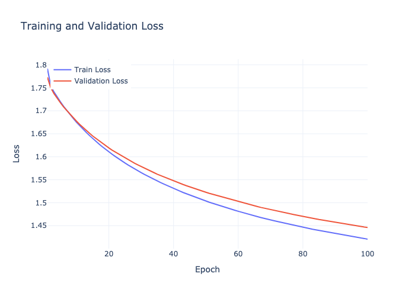
<figcaption>LR = 10−5</figcaption>
</figure>
<figure>
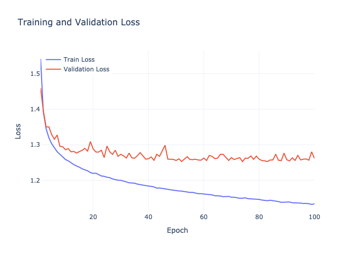
<figcaption>LR = 10−3</figcaption>
</figure>
<figure>
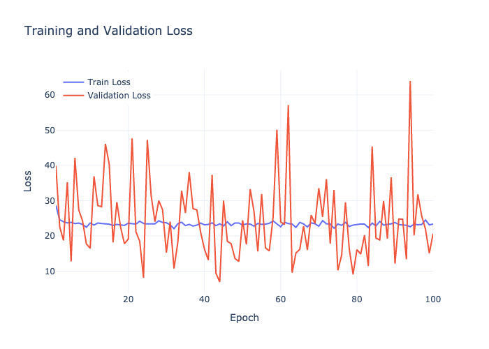
<figcaption>LR = 0.1</figcaption>
</figure>
<figcaption>Logistic Regression: Training and Validation Loss for
different Learning Rates.</figcaption>
</figure>

## Logistic Regression: Validation Accuracy

<figure id="fig:log_reg_acc">
<figure>
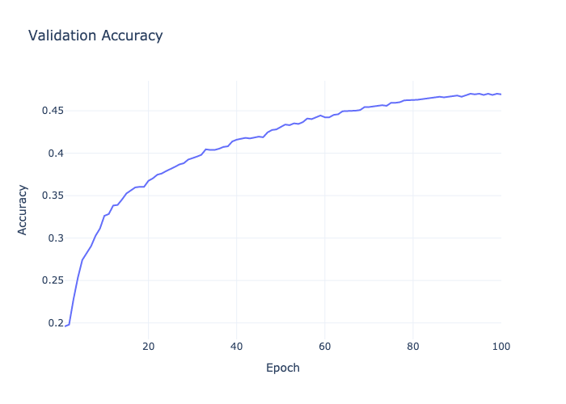
<figcaption>LR = 10−5</figcaption>
</figure>
<figure>
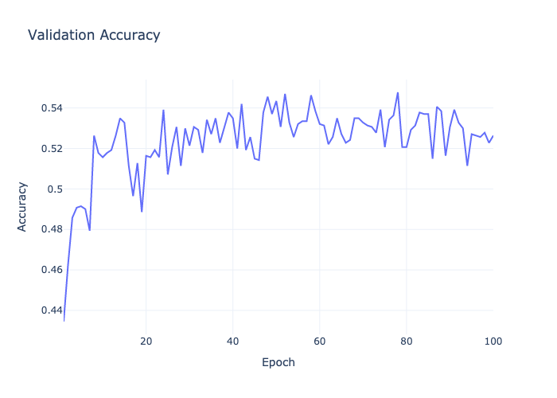
<figcaption>LR = 10−3</figcaption>
</figure>
<figure>
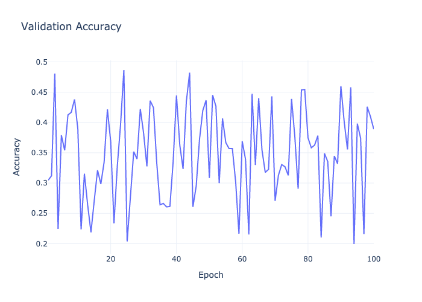
<figcaption>LR = 0.1</figcaption>
</figure>
<figcaption>Logistic Regression: Validation Accuracy for different
Learning Rates.</figcaption>
</figure>

### Default Hyperparameters vs. Batch Size = 512

The effect of varying the batch size between the default (64) and a
larger value (512) was explored.

<figure id="fig:mlp_batch_size_loss">
<figure>
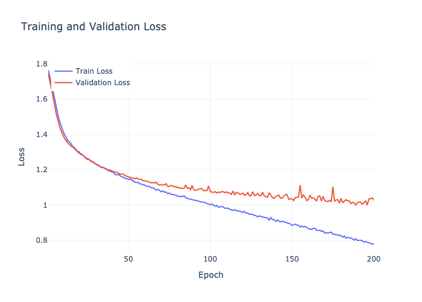
<figcaption>Batch Size = 64</figcaption>
</figure>
<figure>
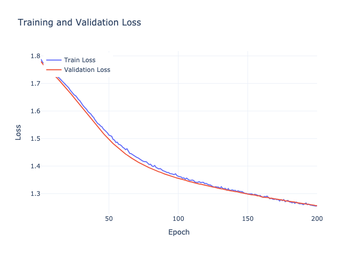
<figcaption>Batch Size = 512</figcaption>
</figure>
<figcaption>MLP: Training and Validation Loss for different Batch
Sizes.</figcaption>
</figure>

<figure id="fig:mlp_batch_size_acc">
<figure>
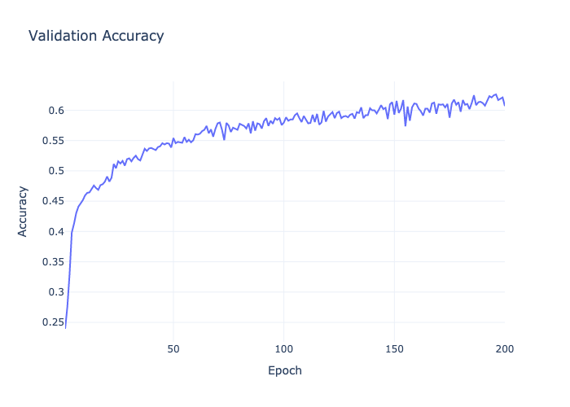
<figcaption>Batch Size = 64</figcaption>
</figure>
<figure>
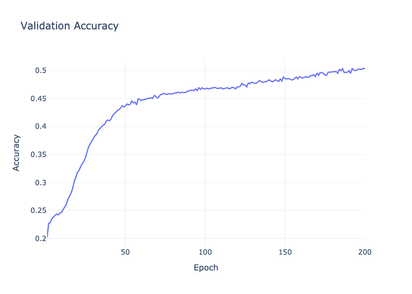
<figcaption>Batch Size = 512</figcaption>
</figure>
<figcaption>MLP: Validation Accuracy for different Batch
Sizes.</figcaption>
</figure>

## MLP: Training and Validation Loss (Effect of Dropout)

<figure id="fig:mlp_dropout_loss">
<figure>
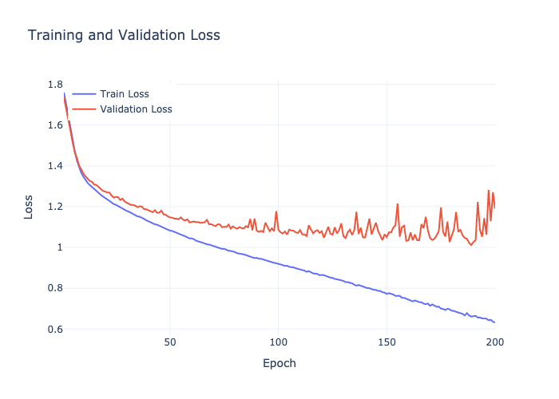
<figcaption>Dropout = 0.01</figcaption>
</figure>
<figure>
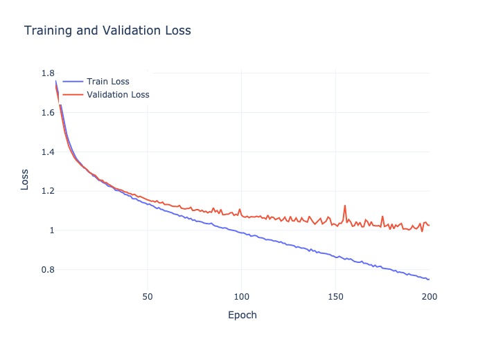
<figcaption>Dropout = 0.25</figcaption>
</figure>
<figure>
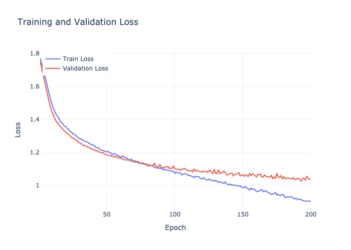
<figcaption>Dropout = 0.5</figcaption>
</figure>
<figcaption>MLP: Training and Validation Loss for different Dropout
values.</figcaption>
</figure>

## MLP: Validation Accuracy (Effect of Dropout)

<figure id="fig:mlp_dropout_acc">
<figure>
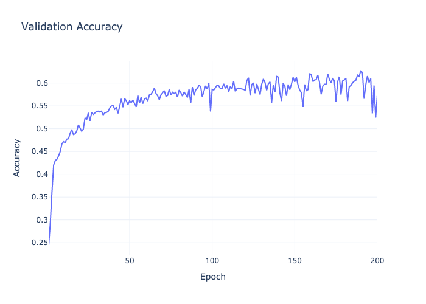
<figcaption>Dropout = 0.01</figcaption>
</figure>
<figure>
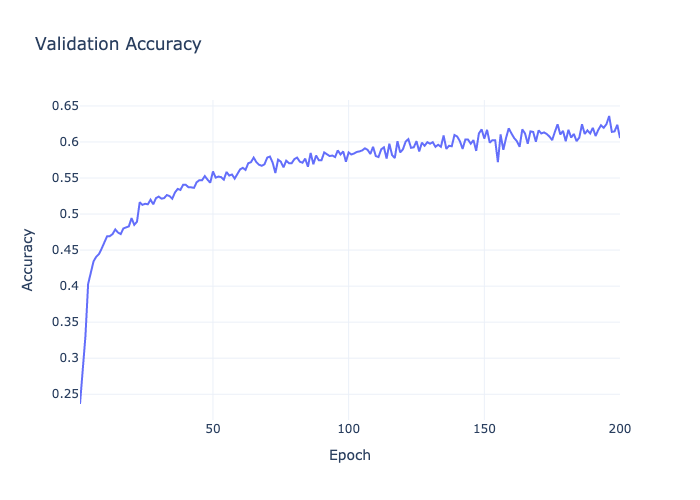
<figcaption>Dropout = 0.25</figcaption>
</figure>
<figure>
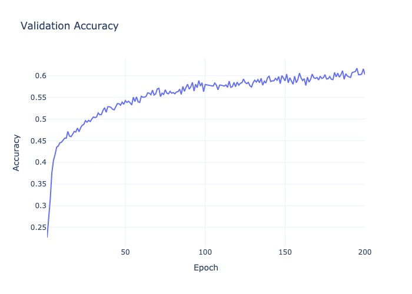
<figcaption>Dropout = 0.5</figcaption>
</figure>
<figcaption>MLP: Validation Accuracy for different Dropout
values.</figcaption>
</figure>

## MLP: Effect of Momentum

<figure id="fig:mlp_momentum_loss">
<figure>
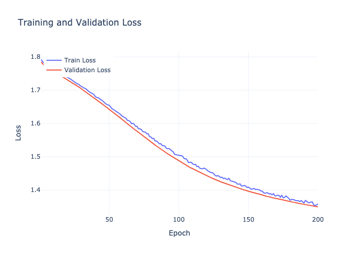
<figcaption>Momentum = 0.0</figcaption>
</figure>
<figure>
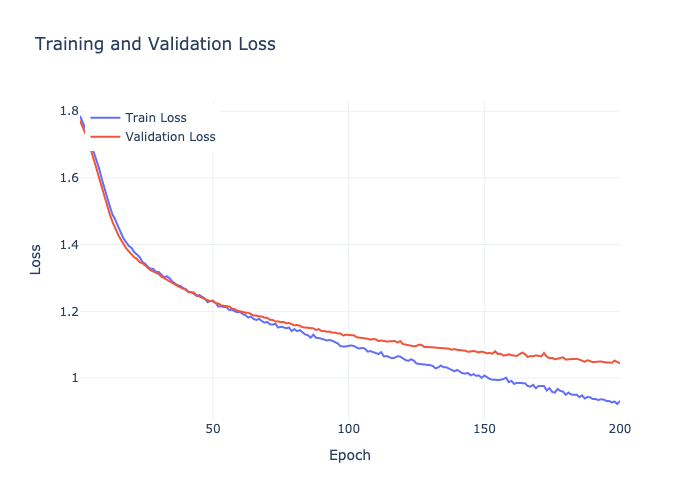
<figcaption>Momentum = 0.9</figcaption>
</figure>
<figcaption>MLP: Training and Validation Loss for different Momentum
values.</figcaption>
</figure>

<figure id="fig:mlp_momentum_acc">
<figure>
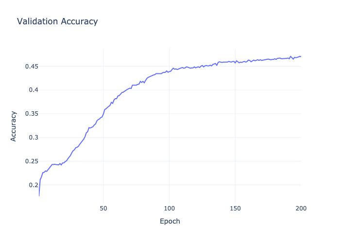
<figcaption>Momentum = 0.0</figcaption>
</figure>
<figure>
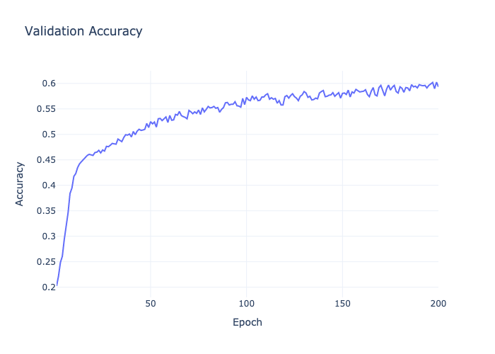
<figcaption>Momentum = 0.9</figcaption>
</figure>
<figcaption>MLP: Validation Accuracy for different Momentum
values.</figcaption>
</figure>
